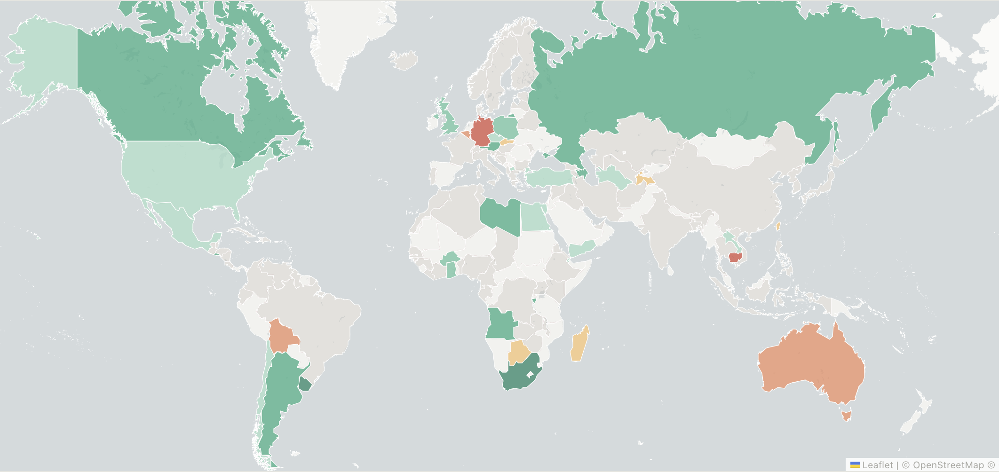

<div align="center">

# Mr. Worldwide

Reading one book from each country in 2026.

[](https://www.goodreads.com/review/list/102139159-julia-azziz?shelf=mr-worldwide)
[](https://juliaazziz.github.io/mr-worldwide/)
[](https://github.com/Safouene1/support-palestine-banner/blob/master/Markdown-pages/Support.md)

</div>

## About

[Goodreads](https://www.goodreads.com/review/list/102139159-julia-azziz?shelf=mr-worldwide) saw it first.

<div align="center">
  
</div>

Check out the challenge site [here](https://juliaazziz.github.io/mr-worldwide/).

### Current stats

<!-- STATS:START -->
```
 Countries read:        43 / 196  (21.9%)
 Average rating:        3.21 / 5.00
 Female authors:        40% of books read
 In spanish:            12 books
 In english:            31 books

  Progress: [██████████░░░░░░░░░░░░░░░░░░░░░░░░░░░░░░░░░░░░░░░░] 21.9%

```
<!-- STATS:END -->

## Setup

To set up the repo and install all necessary packages with [uv](https://github.com/astral-sh/uv):
```sh
uv venv
source .venv/bin/activate
uv sync --all-groups
```

---

<div align="center">

*Developed with ❤︎*

</div>
